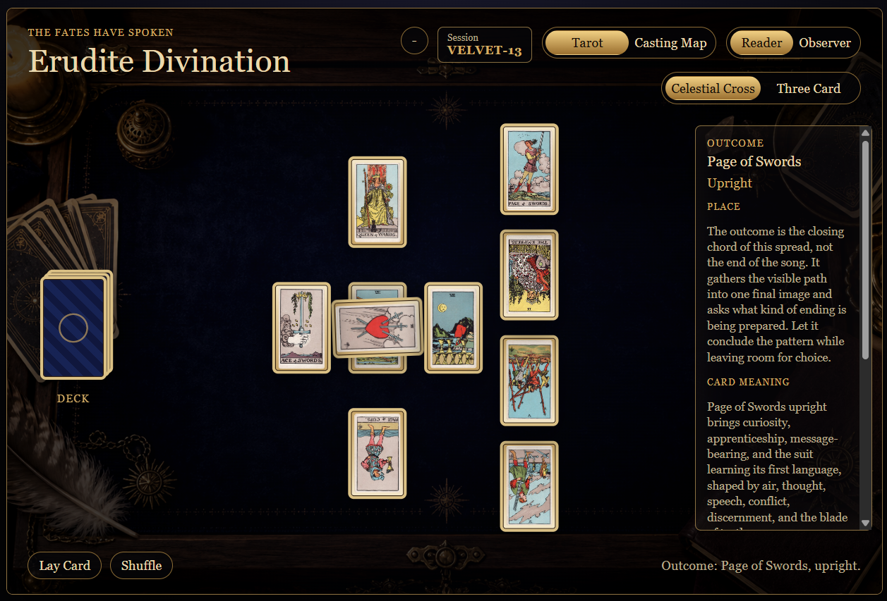
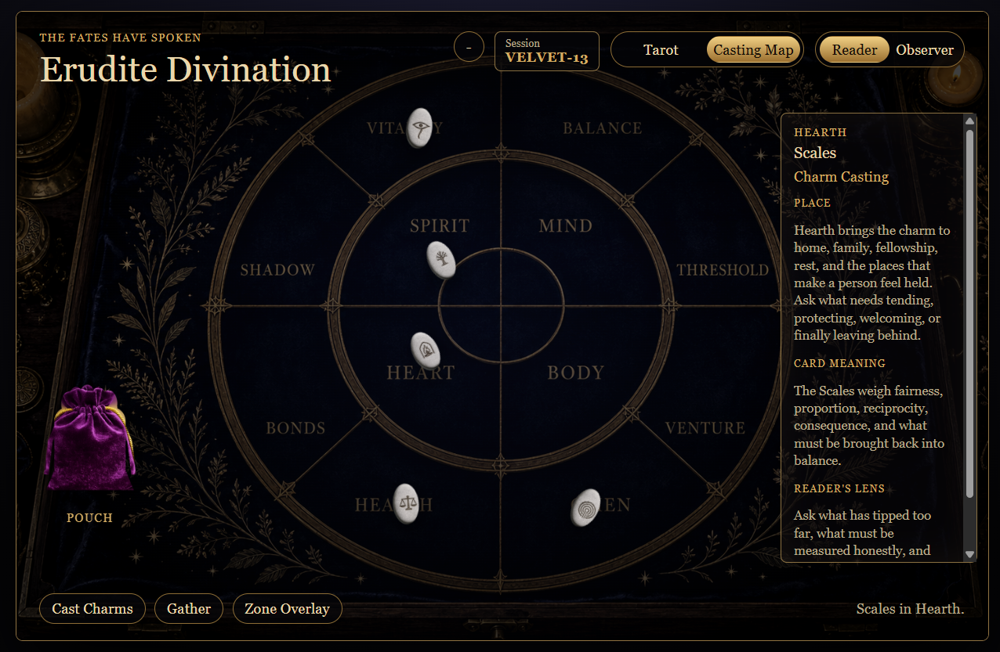

# Erudite-Divination

<h2>Preview</h2>

  <table>
    <tr>
      <td align="center">
         
        <strong>Tarot Reading</strong> 
        <em>Celestial (Celtic Cross)</em>
      </td>

      <td width="30"></td>

      <td align="center">
         
        <strong>Rune Casting</strong> 
        <em>Original Charm Casting System</em>
      </td>
    </tr>
  </table>

<i>The fates have spoken.</i>

Erudite Divination is an immersive divination toolkit for **Final Fantasy XIV**, built with the **Dalamud** framework for roleplayers, storytellers, and people who enjoy the pagan arts of tarot and rune casting alike.

Inspired by mystical pagan libraries, occult manuscripts, candlelit studies, and handcrafted ritual tools, Erudite Divination transforms divination into a shared in-game experience. Rather than simply drawing random cards, the plugin presents beautifully designed reading spaces where symbolism, interpretation, and collaborative storytelling come together.

## Planned Features

- 🔮 Tarot readings featuring the public-domain Rider–Waite deck
- 🪨 Rune and charm casting using an original divination system
- 👁️ Reader and Observer modes for collaborative roleplay
- 🗺️ Multiple reading layouts, including Celtic Cross and Casting Maps
- 📜 Rich interpretations and narrative prompts
- 🎨 Handcrafted archival-inspired interface and animations
- ⚙️ Modular architecture designed to support future divination traditions

## Philosophy

Erudite Divination is designed to feel less like a game mechanic and more like opening an antique divination cabinet. Every interaction—from shuffling cards to casting runes—is intended to encourage atmosphere, reflection, and shared storytelling while remaining respectful of the traditions that inspired it.

---

*"Seek wisdom. Draw with intention."*

## Current State

The plugin currently has a basic local dev skeleton:

- `/divination` opens and closes the main window.
- `/tarot` still works as a temporary fallback command.
- The main window is movable and uses Dalamud windowing.
- The first mock table layout is drawn with ImGui placeholder colors and shapes.
- Reader and Observer preview states are separated visually.
- The reader side shows private journal-style guidance placeholders.
- The observer side shows public board-state placeholders.

Deck logic, charm casting, image assets, shared observer behavior, and saved readings are not implemented in the plugin yet.

## Safety Boundary

Erudite Divination should remain a roleplay interface only. It should not:

- automate gameplay
- inspect combat, encounter, or player state for decisions
- modify game memory
- send or intercept packets
- perform hidden actions on behalf of the player

The reader controls the table. Observers should be able to witness public board state without gaining access to reader-private guidance or controls.
